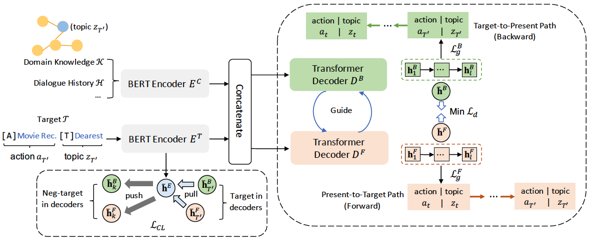
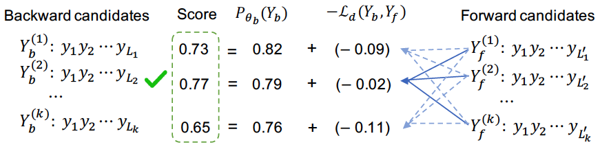
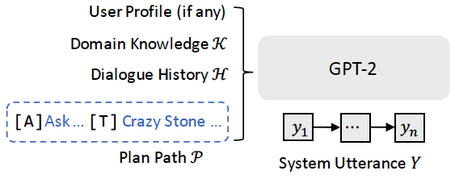
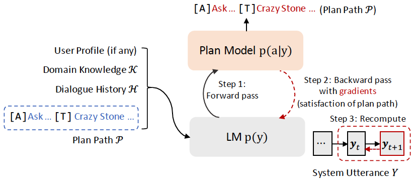

# TRIP
This repository contains code and data for the paper [Target-constrained Bidirectional Planning for Generation of Target-oriented Proactive Dialogue](https://arxiv.org/abs/2403.06063) accepted by ACM Transactions on Information Systems (TOIS).

## Overview
We propose a novel target-constrained bidirectional planning (TRIP) approach for target-oriented proactive dialogue systems. It plans an appropriate dialogue path by *looking ahead* and *looking back*, bidirectionally generating a dialogue path consisting of a sequence of <action, topic> pairs using two Transformer decoders. They are expected to supervise each other and converge on consistent actions and topics by minimizing the decision gap and contrastive generation of targets. 
<p align="center">

</p>

Moreover, we propose a target-constrained decoding algorithm with a bidirectional agreement to better control the inference process of dialogue planning. 
<p align="center">

</p>

Subsequently, we adopt the planned dialogue paths to guide dialogue generation in a pipeline manner, where we explore two variants: ***prompt-based*** generation and ***plan-controlled*** generation. 
<p align="center">

</p>
<p align="center">

</p>


## Requirements
The required packages are listed in `requirements.txt`. Suppose you use [Anaconda](https://www.anaconda.com/) to manage the Python dependencies, you can install them by running:
```bash
conda create -n trip python=3.9.7
conda activate trip
pip install -r requirements.txt
```


## Datasets
Please download the repurposed datasets from the following OneDrive links:
- [DuRecDial](https://connectpolyu-my.sharepoint.com/:u:/g/personal/21037774r_connect_polyu_hk/ESAEWP_Q9_BFqOHxHZbeAIwBxQPoLnLtPAlpgz0r61JYkw?e=ksZ4b8) (Chinese)
- [DuRecDial 2.0](https://connectpolyu-my.sharepoint.com/:u:/g/personal/21037774r_connect_polyu_hk/ERZEMLJO8cpBvT9HZKX9sKUB9BtQ4CNLHzR46TzHNL-c7Q?e=xMZp7Q) (English)


## Quickstart

### Training TRIP
```python
python main_plan.py --mode train --lang "en" \
    --train_data "data/DuRecDial2_en/sample_train.jsonl" \
    --dev_data "data/DuRecDial2_en/sample_dev.jsonl" \
    --cache_dir "caches/DuRecDial2_en/plan" \
    --log_dir "logs/DuRecDial2_en/plan" \
    --num_epochs 10 \
    --batch_size 6
```

### Planned Path Generation
```python
python main_plan.py --mode test --lang "en" \
    --test_data "data/DuRecDial2_en/sample_test_seen.jsonl" \
    --cache_dir "caches/DuRecDial2_en/plan" \
    --log_dir "logs/DuRecDial2_en/plan" \
    --output_dir "outputs/DuRecDial2_en/plan" \
    --test_batch_size 1 \
    --max_dec_len 80 \
    --beam_size 3
```
Note that the output file `best_model_test_seen.jsonl` or `best_model_test_unseen.jsonl` will be saved in the `--output_dir`.

### Dialogue Model Fine-tuning
```python
python main_dial.py --mode train --lang "en" \
    --train_data "data/DuRecDial2_en/sample_train.jsonl" \
    --dev_data "data/DuRecDial2_en/sample_dev.jsonl" \
    --cache_dir "caches/DuRecDial2_en/dial" \
    --log_dir "logs/DuRecDial2_en/dial" \
    --num_epochs 5 \
    --batch_size 8 \
    --use_control false
```
If you want to use the planned paths to control the dialogue generation, set `--use_control true`.

### Dialogue Generation
```python
python main_dial.py --mode test --lang "en" \
    --test_data "data/DuRecDial2_en/sample_test_seen.jsonl" \
    --plan_data "outputs/DuRecDial2_en/plan/best_model_test_seen.jsonl" \
    --cache_dir "caches/DuRecDial2_en/dial" \
    --log_dir "logs/DuRecDial2_en/dial" \
    --output_dir "outputs/DuRecDial2_en/dial" \
    --turn_type_size 6 \
    --test_batch_size 4 \
    --max_dec_len 100
```
Note that the `--plan_data` is the file path to the planned dialogue paths generated by TRIP, `--output_dir` is the directory to save the generated utterances.


## Evaluation
To evaluate the performance dialogue planning, please run:
```python
python eval/eval_planning.py --eval_file <path_to_eval> --gold_file <path_to_gold_data>
```
To evaluate the performance of dialogue generation, please run:
```python
python eval/eval_dialogue.py --lang <"zh"|"en"> --eval_file <path_to_eval> --gold_file <path_to_gold_data>
```

## Citation
If you find this repo helpful, please kindly cite our work as:
```bibtex
@article{wang2024target,
    title={Target-constrained Bidirectional Planning for Generation of Target-oriented Proactive Dialogue},
    author={Wang, Jian and Lin, Dongding and Li, Wenjie},
    journal={ACM Transactions on Information Systems (TOIS)},
    year={2024},
    publisher={ACM}
}
```
